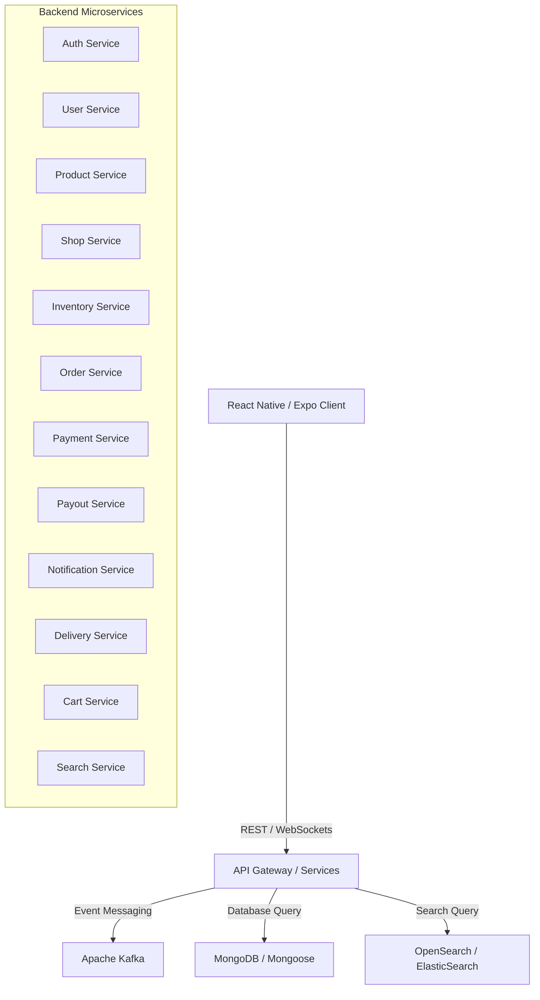

# Your Chemist — Distributed Microservices Backend

This repository houses the entire distributed backend architecture for **Your Chemist**, a multi-tenant platform connecting customers, pharmacies (shops), and delivery partners. The ecosystem consists of multiple specialized, lightweight microservices built with **Node.js**, **Express**, and **TypeScript**, communicating asynchronously via **Apache Kafka** and storing data across **MongoDB/Mongoose**, **OpenSearch/ElasticSearch**, and **Cloudinary** for image storage.

---

## 🏗️ Architectural Overview



---

## 🛠️ Technology Stack

* **Runtime**: [Node.js](https://nodejs.org) (v20+)
* **Framework**: [Express](https://expressjs.com) (v5+)
* **Language**: [TypeScript](https://www.typescriptlang.org) (v5/v6)
* **Databases**: [MongoDB](https://www.mongodb.com) (via Mongoose v8)
* **Search Engine**: [OpenSearch](https://opensearch.org) / [Elasticsearch](https://www.elastic.co)
* **Event Broker**: [Apache Kafka](https://kafka.apache.org) (via `kafkajs`)
* **Real-time**: [Socket.io](https://socket.io) for order tracking
* **AI Integration**: AI-driven medical catalog metadata extraction
* **File Storage**: Cloudinary with customized Multer middleware
* **Process Monitor**: Dynamic Keep-Alive Status Server (`alive.js`) for Render health-check bindings

---

## ⚡ New Features & Standardizations

### 🛡️ Unified Error Handling Protocol
To guarantee absolute type safety, predictability, and a seamless client experience, we have introduced a **Standardized Microservice Blueprint** for error handling. 

* **The `ApiError` Class**: An extension of the native JavaScript `Error` that enforces standard metadata propagation:
  * `statusCode` / `status` (integer): Valid HTTP Status Codes (`400`, `401`, `403`, `404`, `409`, `500`)
  * `message` (string): Human-readable error description
  * `errors` (array): Validation detail arrays (e.g. Zod validation breakdowns)
  * `success`: Always `false`
* **Express `errorHandler` Middleware**: A standardized middleware applied across all services that catches errors, normalizes them, and safely responds to the client, preventing server-crashing type errors (like passing an undefined status code).

---

## 📱 Detailed Microservices Map

1. **`auth-service`**: Credentials handling, secure JWT sessions, password resets, and 2-Factor Authentication (2FA) OTP validation.
2. **`user-service`**: Managing user profiles, customer preferences, and global permissions.
3. **`product-service`**: AI-driven medical catalog metadata parser, Cloudinary-backed drug image processors, price hydration, and search integration.
4. **`shop-service`**: Vendor storefront setups, administration panels, and automated low-stock warnings.
5. **`inventory-service`**: Real-time batch-tracking, medicine expiry logs, and dynamic stock allocations.
6. **`cart-service`**: Customer carts, pricing calculators, and session persistent states.
7. **`order-service`**: Order life-cycle states (*Pending → Confirmed → Packing → Out for Delivery*).
8. **`payment-service`**: Secure customer wallets and external **Razorpay** payment gates.
9. **`payout-service`**: Managing pharmacy payouts, bank transfers, and vendor ledgers.
10. **`notification-service`**: Template seeders for automated Email/SMS updates, and delivery alerts.
11. **`delivery-service`**: Delivery partner matching, real-time dispatching, and status updates.
12. **`search-service`**: Ultra-fast geo-fenced pharmacy and medicine discovery.

---

## 🚀 Keep-Alive Health Server (`alive.js`)

Deployed as a free web service in the environment, the `alive.js` engine binds to the necessary port and dynamically monitors the deployment list to avoid cold starts:
* **Cycles**: Standardized ping intervals every **10 minutes**.
* **Self-tracking**: Automatically identifies its own deployment URL (`RENDER_EXTERNAL_URL`) and registers itself into the active keep-alive chain.

---

## 🔧 Getting Started (Backend Development)

### 1. Initialize Submodules
The backend services are configured as git submodules. To clone and check them out:
```bash
git submodule update --init --recursive
```

### 2. Launch Local Environment
Each service has its own dedicated `.env` file and structure. Simply enter a service directory (e.g., `product-service`) and run:
```bash
npm install
npm run dev
```
